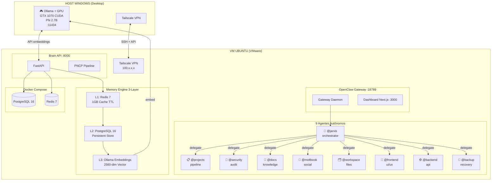
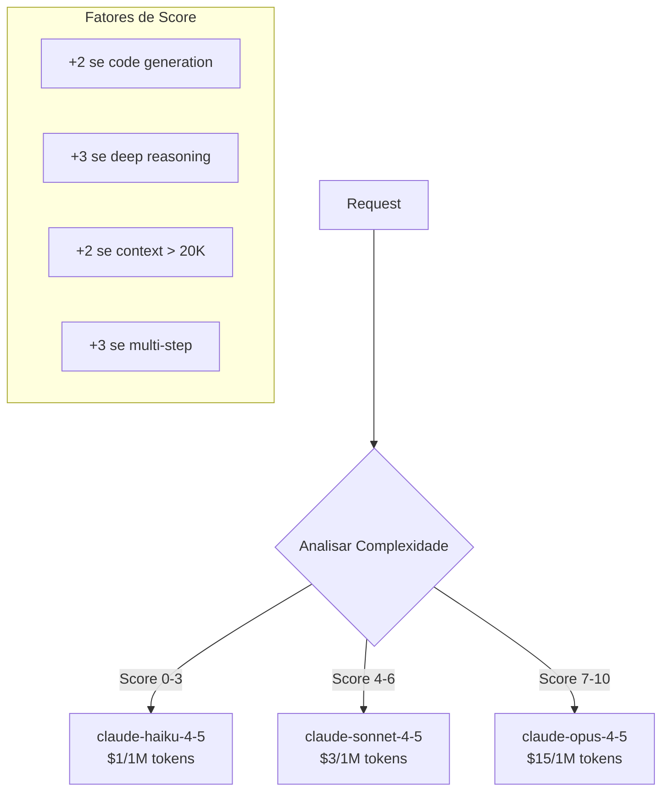
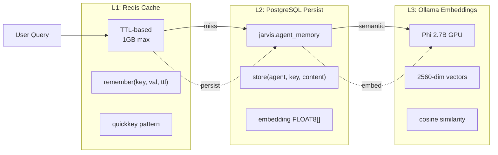
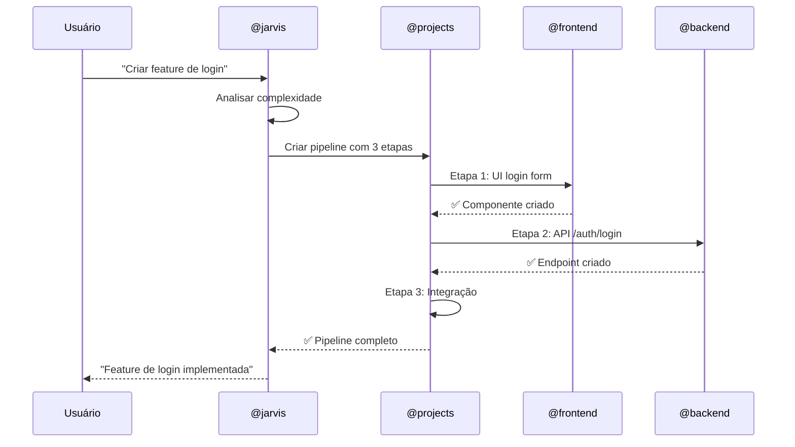
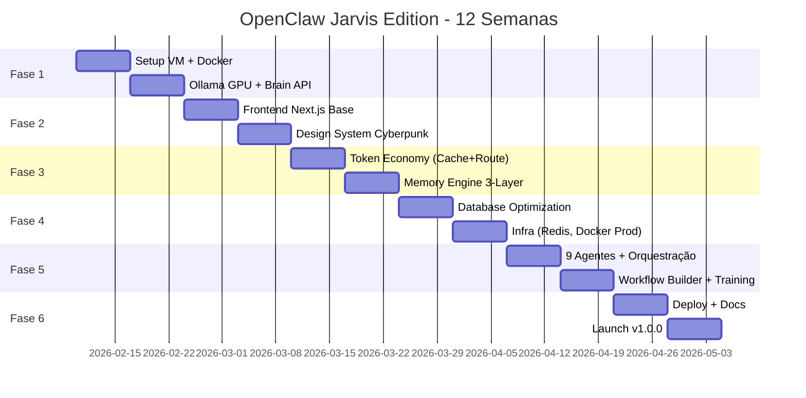

# 🦞 BRAINSTORM PREMIUM DEFINITIVO: OpenClaw Jarvis Edition

> **Análise Completa:** Tutorial Multi-Agente v3.1 + Planejamento 12 Semanas  
> **Hardware:** Intel Xeon E5-2650 v4 | 32 GB RAM | GTX 1070 8GB | 1.23 TB  
> **Fevereiro 2026** | JPL Tecnologia

---

## 📋 VISÃO INTEGRADA DA ARQUITETURA

### Diagrama Completo do Sistema



### Componentes e Funções

| Componente | Local | Porta | Função |
|------------|-------|-------|--------|
| **Ollama + Phi 2.7B** | Host Windows | 11434 | Embeddings GPU CUDA (50-100ms) |
| **OpenClaw Gateway** | VM Ubuntu | 18789 | Orquestração de agentes |
| **Dashboard Next.js** | VM Ubuntu | 3000 | Interface Mission Control |
| **Brain API (FastAPI)** | VM Ubuntu | 8000 | API central, memória, PNCP |
| **PostgreSQL 16** | VM Docker | 5432 | L2 Memory, agent_memory, licitacoes |
| **Redis 7** | VM Docker | 6379 | L1 Cache TTL, pub/sub |
| **Tailscale VPN** | Ambos | - | Acesso mesh WireGuard |

---

## 💰 ÁREA 1: TOKEN ECONOMY (FATOR PRINCIPAL)

### Economia Esperada Total: 75-85%

| Otimização | Técnica | Economia | Semana |
|------------|---------|----------|--------|
| **Prompt Caching** | `cache_control: {type: "ephemeral"}` | **64%** | 5 |
| **Smart Model Routing** | Haiku < Sonnet < Opus por complexidade | **60-80%** | 5 |
| **Context Summarization** | Haiku para resumir histórico | **68%** | 5 |
| **Redis Response Cache** | Cache de respostas frequentes | **85% hit** | 7 |
| **Summary Caching SQLite** | Persistir resumos de compaction | **20-30%** | 5 |

### 1.1 Prompt Caching Anthropic

```typescript
// src/services/promptCache.service.ts
export class PromptCacheManager {
  async buildSystemPrompt(): Promise<object[]> {
    return [
      {
        type: "text",
        text: this.loadFile('AGENTS.md'), // Cacheable (estático)
        cache_control: { type: "ephemeral" }
      },
      {
        type: "text", 
        text: this.loadFile('SOUL.md'), // Cacheable (estático)
        cache_control: { type: "ephemeral" }
      },
      {
        type: "text",
        text: this.buildToolsPrompt(), // Cacheable (muda pouco)
        cache_control: { type: "ephemeral" }
      },
      {
        type: "text",
        text: this.buildDynamicContext(), // NÃO cachear (dinâmico)
        // sem cache_control
      }
    ];
  }
}
```

**Economia:** 1ª call $0.84 → 2ª+ call $0.30 = **64% economia**

### 1.2 Smart Model Routing



**Economia agregada:** 60-80%

### 1.3 Context Summarization

```typescript
// Quando context > 80% do limite (80K tokens)
async summarizeAndCompact(session: Session): Promise<void> {
  const recentMessages = session.messages.slice(-20); // Manter
  const oldMessages = session.messages.slice(0, -20); // Sumarizar
  
  // Usar Haiku (15x mais barato!) para sumarização
  const summary = await anthropic.messages.create({
    model: 'claude-haiku-4-5',
    messages: [{ role: 'user', content: `Summarize: ${JSON.stringify(oldMessages)}` }]
  });
  
  // Novo context compactado
  session.messages = [
    { role: 'system', content: `Previous summary:\n${summary}` },
    ...recentMessages
  ];
}
```

**Economia:** 80K → 25K tokens = **68% redução**

---

## 🧠 ÁREA 2: MEMORY ENGINE 3-LAYER

### Arquitetura Detalhada



### Schema PostgreSQL

```sql
-- jarvis.agent_memory (L2 + L3)
CREATE TABLE jarvis.agent_memory (
  id SERIAL PRIMARY KEY,
  agent_name VARCHAR(50),        -- @jarvis, @projects, etc.
  key VARCHAR(200),              -- identificador único
  value JSONB,                   -- conteúdo estruturado
  embedding FLOAT8[],            -- vetor 2560 dimensões (Phi 2.7B)
  ttl TIMESTAMP,                 -- expiração opcional
  created_at TIMESTAMP DEFAULT NOW(),
  updated_at TIMESTAMP DEFAULT NOW()
);

CREATE INDEX idx_agent_memory_agent ON jarvis.agent_memory(agent_name);
CREATE INDEX idx_agent_memory_key ON jarvis.agent_memory(agent_name, key);
```

### API Brain (FastAPI)

```python
# ~/jarvis/brain-api/main.py
OLLAMA_URL = "http://192.168.72.2:11434"  # Host Windows GPU!

@app.post('/memory/store')
async def memory_store(agent: str, key: str, value: dict):
    val_str = json.dumps(value)
    
    # L1: Redis (TTL 1 hora)
    await redis.setex(f'mem:{agent}:{key}', 3600, val_str)
    
    # L2: PostgreSQL (persistente)
    await db.execute('''
        INSERT INTO jarvis.agent_memory (agent_name, key, value)
        VALUES ($1, $2, $3) ON CONFLICT (agent_name, key) DO UPDATE SET value = $3
    ''', agent, key, val_str)
    
    # L3: Embedding via Ollama GPU
    emb = await get_embedding(val_str)  # 50-100ms com GTX 1070
    await db.execute('UPDATE jarvis.agent_memory SET embedding = $1 WHERE agent_name = $2 AND key = $3', emb, agent, key)
    
    return {'status': 'stored', 'layers': ['L1', 'L2', 'L3']}

async def get_embedding(text: str) -> list:
    async with httpx.AsyncClient(timeout=30) as client:
        resp = await client.post(f'{OLLAMA_URL}/api/embeddings', json={'model': 'phi', 'prompt': text})
    return resp.json()['embedding']  # 2560 floats
```

---

## 🤖 ÁREA 3: SISTEMA DE 9 AGENTES AUTÔNOMOS

### Tabela de Agentes

| Agente | Papel | Iter. | Tools | Função |
|--------|-------|-------|-------|--------|
| **@jarvis** | Orchestrator | 50 | 15 | Coordena todos, delega tarefas |
| **@projects** | Pipeline Manager | 30 | 17 | Pipelines de execução, dependências |
| **@security** | Security | 30 | 18 | Auditoria, compliance, vulnerabilidades |
| **@docs** | Documentation | 30 | 17 | Documentação automática |
| **@moltbook** | AI Social | 30 | 20 | Feed social entre agentes |
| **@workspace** | Workspace Mgmt | 30 | 22 | Gerencia arquivos, ambiente |
| **@frontend** | Frontend/UI | 50 | 18 | Desenvolvimento frontend |
| **@backend** | Backend/API | 30 | 17 | Desenvolvimento backend |
| **@backup** | Backup/Recovery | 30 | 25 | Backup e recuperação |

### Fluxo de Delegação



---

## 🎨 ÁREA 4: FRONTEND NEXT.JS PREMIUM

### Design System Cyberpunk/Neon

```css
:root {
  /* Base Dark */
  --bg-primary: #0a0e14;
  --bg-secondary: #13171f;
  --bg-card: #1a1f2e;
  --bg-elevated: #232938;
  
  /* Neon Accents */
  --neon-cyan: #00f0ff;
  --neon-magenta: #ff00aa;
  --neon-green: #00ff88;
  --neon-orange: #ff6600;
  --neon-yellow: #ffcc00;
  
  /* Status Colors */
  --status-online: #00ff88;
  --status-working: #ffcc00;
  --status-analyzing: #00f0ff;
  --status-searching: #ff00aa;
  --status-idle: #666666;
  --status-error: #ff4444;
  
  /* Glow Effects */
  --glow-cyan: 0 0 20px rgba(0, 240, 255, 0.5);
  --glow-green: 0 0 20px rgba(0, 255, 136, 0.5);
  --glow-magenta: 0 0 20px rgba(255, 0, 170, 0.5);
}
```

### Estrutura de Páginas

```
app/
├── layout.tsx              # Sidebar + Header premium
├── page.tsx                # Mission Control Dashboard
├── agents/
│   ├── page.tsx            # Kanban: Inbox/Em Andamento/Concluído/Falhou
│   └── [id]/page.tsx       # Detalhes do agente
├── brain/
│   ├── page.tsx            # Estatísticas (Ações, Sucessos, Erros, Taxa)
│   └── training/page.tsx   # Training Mode
├── monitor/
│   ├── page.tsx            # Status Sistema, DB, Recursos, Conexões
│   └── logs/page.tsx       # Logs real-time
├── config/
│   ├── page.tsx            # Configurações visuais
│   ├── models/page.tsx     # Seleção de modelos
│   └── channels/page.tsx   # Canais (Telegram, WhatsApp, etc.)
├── memory/
│   ├── page.tsx            # Visualização 3-layer
│   └── search/page.tsx     # Busca semântica
└── usage/
    ├── page.tsx            # Dashboard de custos/tokens
    └── history/page.tsx    # Histórico detalhado
```

### Componentes Principais

| Componente | Função | Visual |
|------------|--------|--------|
| **StatusCard** | Métricas com status neon | Borda glow, ícone animado |
| **AgentKanban** | Boards de tarefas | 4 colunas com drag-drop |
| **ActivityFeed** | Status real-time Jarvis | Lista com badges IDLE/WORKING/ANALYZING |
| **TokenEconomyChart** | Gráfico de economia | Área com gradiente neon |
| **ServiceStatus** | Status de serviços | Badges Online/Offline |
| **ConfigPanel** | Configurações | Forms com sliders neon |

---

## 📅 ÁREA 5: ROADMAP REVISADO (12 Semanas)

### Visão Geral



### Fases Detalhadas

| Fase | Semanas | Entregas | Prioridade |
|------|---------|----------|------------|
| **1: Setup** | 1-2 | VM Ubuntu, Docker, Ollama GPU, Brain API | 🔴 Crítico |
| **2: Frontend** | 3-4 | Next.js, Design System, Mission Control | 🔴 Crítico |
| **3: Performance** | 5-6 | Token Economy (85% economia!), Memory 3-Layer | 🔴 Crítico |
| **4: Database** | 7-8 | Indexes, Redis Cache, Docker Prod | 🟡 Alta |
| **5: Features** | 9-10 | 9 Agentes, Workflow Builder, Training | 🟡 Alta |
| **6: Launch** | 11-12 | Deploy, Docs, E2E Tests, v1.0.0 | 🟡 Alta |

---

## 📊 MÉTRICAS ESPERADAS

| Métrica | Atual | Jarvis Edition | Melhoria |
|---------|-------|----------------|----------|
| Custo/1K requests | $8.40 | $1.20 | **85% ↓** |
| Latência média | 3000ms | 400ms | **87% ↓** |
| Cache hit rate | 0% | 85% | **85% ↑** |
| Bundle size | 2MB | 300KB | **85% ↓** |
| DB query time | 210ms | 5ms | **98% ↓** |
| Embedding time | 500ms (CPU) | 50-100ms (GPU) | **80-90% ↓** |

---

## 📋 DECK DE DECISÕES

| # | Decisão | Opções | Recomendação |
|---|---------|--------|--------------|
| 1 | **LLM Provider** | DeepSeek / Anthropic / OpenAI | DeepSeek V3.2 (custo) |
| 2 | **Embeddings** | Ollama Phi (local) / OpenAI / Voyage | Ollama Phi (GTX 1070!) |
| 3 | **Frontend** | Next.js / React+Vite / Vue | Next.js App Router |
| 4 | **Database** | PostgreSQL / SQLite / Híbrido | PostgreSQL (como no tutorial) |
| 5 | **Deploy** | Docker Compose / Kubernetes | Docker Compose (self-hosted) |
| 6 | **VPN** | Tailscale / WireGuard manual / VPN pago | Tailscale (mesh) |

---

## ✅ PRÓXIMOS PASSOS

### Quick Wins (Semana 1-2, 80% impacto):
1. ✅ Setup VM Ubuntu + Docker (tutorial já pronto!)
2. ✅ Ollama no Host Windows (GPU CUDA)
3. ✅ Brain API FastAPI (endpoints memory/store)
4. ✅ OpenClaw Gateway

### Medium Wins (Semana 3-6, 15% adicional):
5. Next.js + Design System Cyberpunk
6. Prompt Caching (64% economia)
7. Smart Model Routing (60-80% economia)
8. Memory Engine 3-Layer completo

### Long-Term (Semana 7-12, 5% final):
9. 9 Agentes configurados
10. Workflow Builder visual
11. Training Mode
12. Deploy + Launch v1.0.0

---

**Quer que eu comece a implementar alguma área específica?**

1. 🚀 **Começar pelo Setup VM** (Fase 1 - o tutorial já está pronto!)
2. 🎨 **Começar pelo Frontend** (Design System + Next.js)
3. 💰 **Começar pelo Token Economy** (Prompt caching + routing)
4. 🧠 **Começar pelo Memory Engine** (3-Layer com Ollama GPU)
